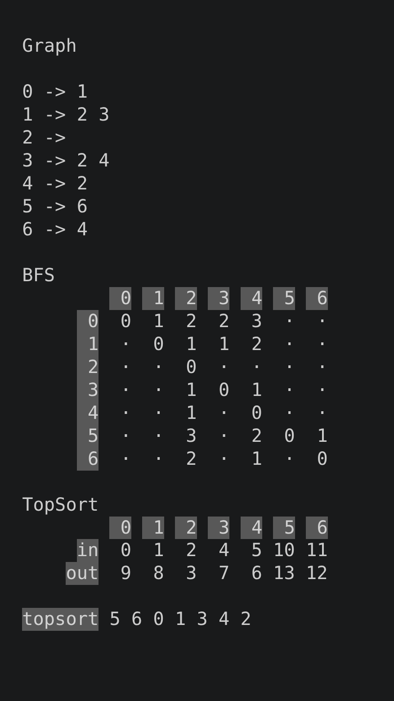
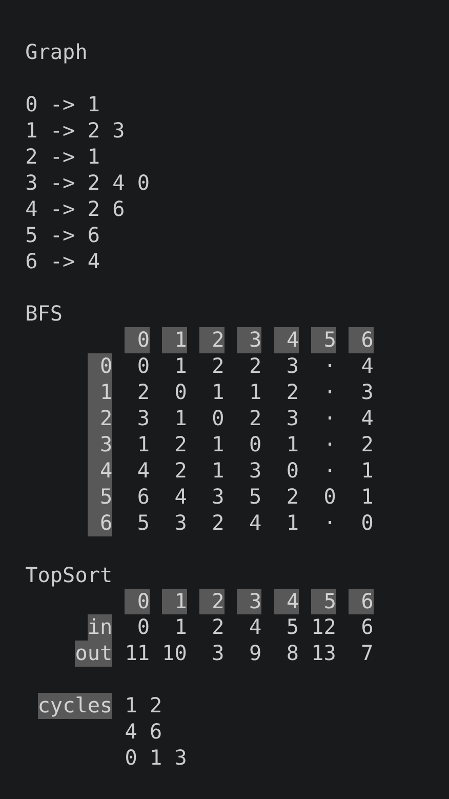
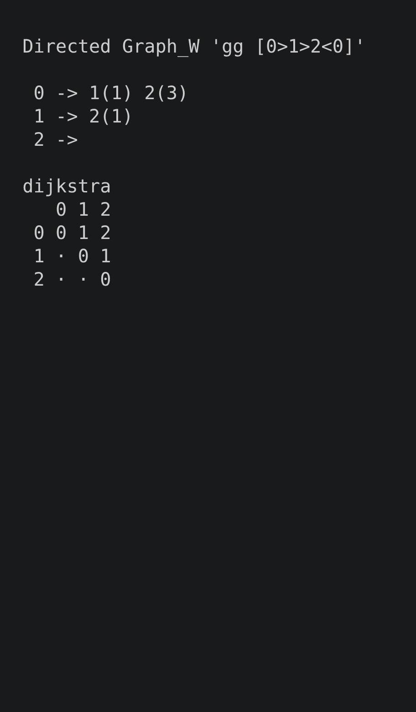
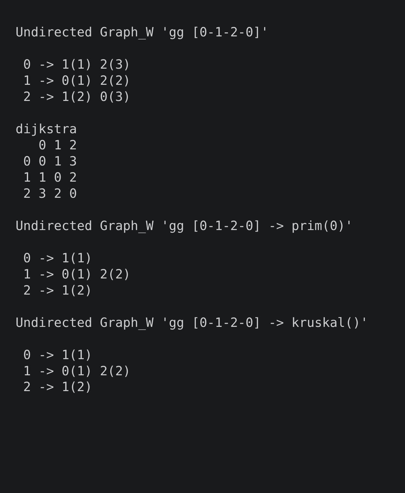

# class Graph

## Demo

<table>
    <tr>
        <td></td>
        <td></td>
        <td></td>
        <td></td>
    </tr>
</table>

## Roadmap

- [x] Graph
- [x] bfs: bfs
- [x] bfs: dist
- [x] topsort: dfs
- [x] topsort: in + out
- [x] topsort: cycles
- [x] topsort: topsort
- [x] Graph_W
- [x] dijkstra
- [x] prim
- [x] kruskal
- [ ] comments: complexity
- [ ] \* merge: Graph_W + Graph
- [ ] \* adj_list / adj_matrix depending on cases
- [ ] \* consider: using dictionaries in some cases
